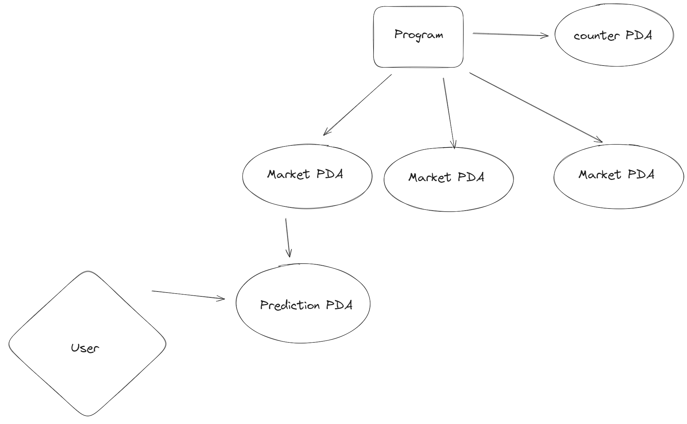
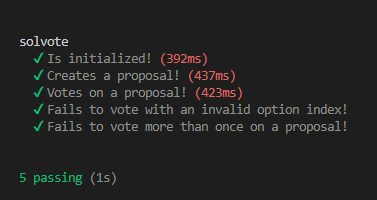

# Solvote

Solvote is a decentralized autonomous organization (DAO) voting system built on the Solana blockchain using Anchor. This project allows users to create proposals, vote on them, and display the results. It also rewards users with points for participating in the voting process.



## Demo

**Video Link:** [Youtube](https://youtu.be/eSriTgYorV0)

## Installation

To set up the project, ensure you have the following installed:

- [Rust](https://www.rust-lang.org/tools/install)
- [Solana CLI](https://docs.solana.com/cli/install-solana-cli-tools)
- [Anchor](https://project-serum.github.io/anchor/getting-started/installation.html)

Clone the repository and navigate to the project directory:

```bash
git clone https://github.com/Jovian-Dsouza/solvote
cd solvote

anchor build
anchor deploy
```

## Tests


### License
This project is licensed under the MIT License.